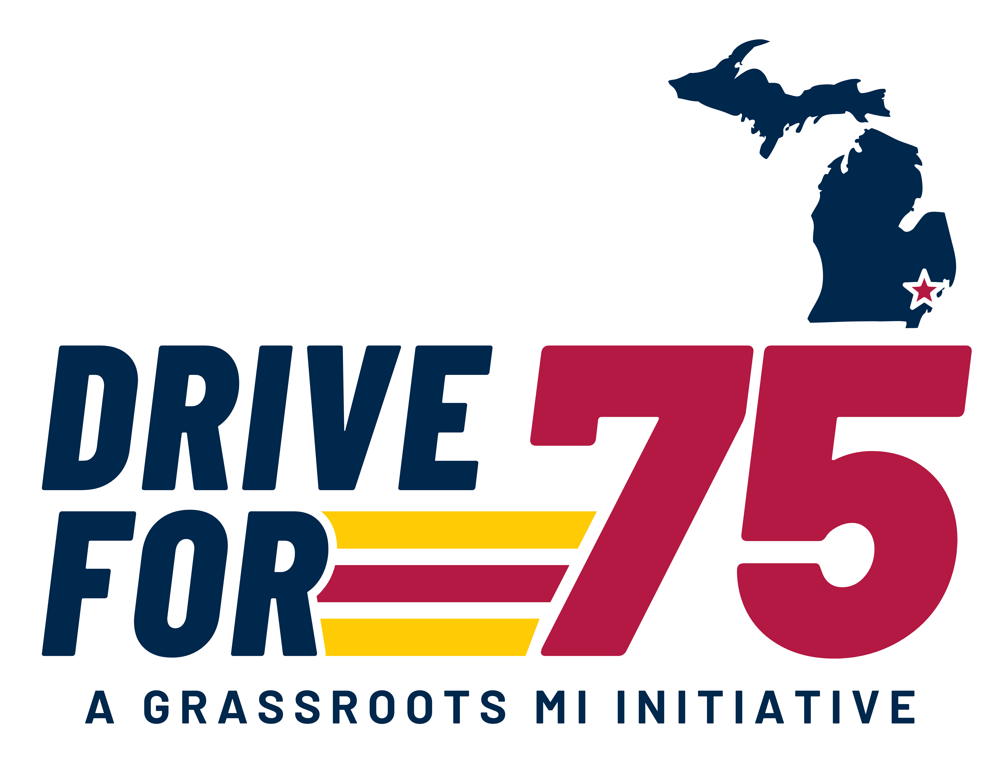

<p align="center">
  
</p>

<h1 align="center">Drive for 75 — Brand Identity</h1>

<p align="center">
  The visual identity for a nonpartisan 501(c)(3) civic-engagement campaign<br>
  building grassroots voter-participation infrastructure across Michigan.
</p>

<p align="center">
  <a href="https://ziad-alhusseiny.github.io/drive-for-75-logos/brand/"><b>Brand guide</b></a> &nbsp;·&nbsp;
  <a href="https://ziad-alhusseiny.github.io/drive-for-75-logos/"><b>Concept archive &amp; team vote</b></a> &nbsp;·&nbsp;
  <a href="brand/assets/">Download assets</a>
</p>

---

## The mark

Interstate 75 runs from Detroit to the top of the Lower Peninsula and keeps going south through
five more states. The mark is built from that road.

| Element | What it is |
|---|---|
| **Michigan** | The full state silhouette, both peninsulas, in Michigan Blue. |
| **The star** | Metro Detroit — where the drive starts — in Old Glory Red with a thin white keyline. |
| **DRIVE FOR** | Barlow Condensed ExtraBold Italic, leaning into the numeral. |
| **75** | Barlow Black Italic, Old Glory Red, spanning both lines of the wordmark. The largest shape, always. |
| **Motion stripes** | Three bars launching from the leg of the **R** in FOR — maize, red, maize. Their forward ends are cut parallel to the diagonal of the 7 at a constant distance, so the top bar runs longest and none of them touches the numeral. |
| **Tagline** | A GRASSROOTS MI INITIATIVE. *GRASSROOTS MI* is set in Barlow Bold so the claim carries; *A* and *INITIATIVE* drop to Barlow Medium and stay quiet. |

Every file is a hand-built vector. The type is converted to outlines, so no fonts are required to
open, print or embroider the mark.

## Colour

Blue leads, maize bridges, red marks the destination. Red is the last colour the eye reaches, never
the first — that order is what keeps the mark civic rather than partisan.

| Name | HEX | RGB | Pantone | Used for |
|---|---|---|---|---|
| Michigan Blue | `#00274C` | 0 · 39 · 76 | PMS 282 | Map, wordmark, tagline |
| Michigan Maize | `#FFCB05` | 255 · 203 · 5 | PMS 7406 | Outer motion stripes |
| Old Glory Red | `#B31942` | 179 · 25 · 66 | — | The 75, the star, centre stripe |
| White | `#FFFFFF` | 255 · 255 · 255 | — | Star keyline, reversed art |

Roughly **60 % blue · 30 % maize · 10 % red**. Do not substitute a generic navy, a brighter yellow,
or a fire-engine red.

## Typography

Barlow carries the whole system. It is open source under the SIL Open Font License, so every partner
can set matching type at no cost — [Barlow](https://fonts.google.com/specimen/Barlow) ·
[Barlow Condensed](https://fonts.google.com/specimen/Barlow+Condensed).

| Role | Cut | Notes |
|---|---|---|
| Wordmark | Barlow Condensed ExtraBold Italic | 800, tracking +4 |
| Numeral | Barlow Black Italic | 900, always the largest shape |
| Tagline | Barlow Bold + Medium | 700 / 500 upright, tracking +9, all caps |

## Files

Everything lives in [`brand/assets/`](brand/assets/).

| Folder | Format | Use |
|---|---|---|
| [`svg/`](brand/assets/svg/) | Vector, outlined | Print, signage, embroidery, web — the master files |
| [`pdf/`](brand/assets/pdf/) | Vector | Hand to printers and designers |
| [`png/`](brand/assets/png/) | 4000 px, transparent | Social media, documents, presentations |

Four versions, each supplied with and without the tagline (`_no-tagline`):

| File | Place it on |
|---|---|
| `drive-for-75_full-color` | White and light backgrounds — the primary logo |
| `drive-for-75_full-color-on-dark` | Michigan Blue, black, dark photography |
| `drive-for-75_black` | One-colour print, engraving, fax, stamps |
| `drive-for-75_white` | Reversed: screen print, vinyl, dark apparel |

Use the tagline version wherever there is room. Drop it below roughly 40 mm / 150 px wide.

## Rules of use

- Keep clear space around the mark equal to the height of the **F** in FOR.
- Minimum width: 40 mm print / 150 px screen with the tagline; 25 mm / 90 px without.
- Do not recolour, stretch, rotate, outline, add effects, or rearrange the elements.
- Do not place the full-colour version on Michigan Blue — use the on-dark version.
- On busy photography, put the mark on a solid white or Michigan Blue panel.
- Red never fills a field and never sets the wordmark.

The [brand guide](https://ziad-alhusseiny.github.io/drive-for-75-logos/brand/) shows each of these
with live examples, a scale slider, and the correct and incorrect cases side by side.

## Repository

```
brand/
  index.html        Brand guide — construction, colour, type, scale, motion, rules
  assets/           SVG · PDF · PNG, four versions, with and without tagline
index.html          Concept archive and team voting page
apps-script.gs      Google Apps Script backend for the vote
logos/              The 20 explored concepts, as SVG
```

Plain HTML, CSS and JavaScript. No build step, no framework, no dependencies.

## Concept archive

The [voting page](https://ziad-alhusseiny.github.io/drive-for-75-logos/) is kept as a record of how
the mark was chosen. Twenty options across six directions, one shared palette so the team compared
ideas rather than colours.

| Direction | Idea | Options |
|---|---|---|
| The Threshold | A ring closed at three quarters: the 75 % goal made visible | 2 |
| The Doorstep | A doorway arch around the 75: every result begins at a household door | 2 |
| The Centerline | The numeral *is* the road — a dashed highway centreline runs through it | 4 |
| The Corridor | The 7 and 5 drawn as one continuous highway with exits | 4 |
| The Campaign | American campaign graphics, I-75 on the Michigan map, starting at Detroit | 4 |
| One Block | The campaign idea rebuilt as a single fused mass | 4 |

**The Campaign** was selected and developed into the final mark.

<details>
<summary>Re-enabling live voting</summary>

GitHub Pages is static, so votes are stored in a Google Sheet through a small Apps Script web app.

1. Create a Google Sheet.
2. Open **Extensions → Apps Script**, delete the sample code, paste `apps-script.gs`, and save.
3. **Deploy → New deployment.** Type: **Web app**. Execute as: **Me**. Who has access: **Anyone**.
   Deploy, then authorise when prompted.
4. Copy the **Web app URL**.
5. In `index.html`, set it on the line near the top of the script:
   ```js
   const VOTE_ENDPOINT = "";
   ```
6. Commit and push.

Votes then land in the sheet in real time and the leaderboard updates itself. Until the URL is set,
Submit opens the voter's email client with a prefilled vote instead, so nothing is lost.

Scoring is weighted — first choice 3 points, second 2, third 1 — and voting again under the same
name replaces the earlier ballot.

</details>

## Running locally

```bash
python -m http.server 8000
```

Then open `http://localhost:8000` for the concept archive, or `http://localhost:8000/brand/` for the
brand guide.

---

<p align="center"><sub>
Barlow and Barlow Condensed are licensed under the SIL Open Font License.<br>
The Drive for 75 name, mark and artwork belong to Grassroots MI.
</sub></p>
